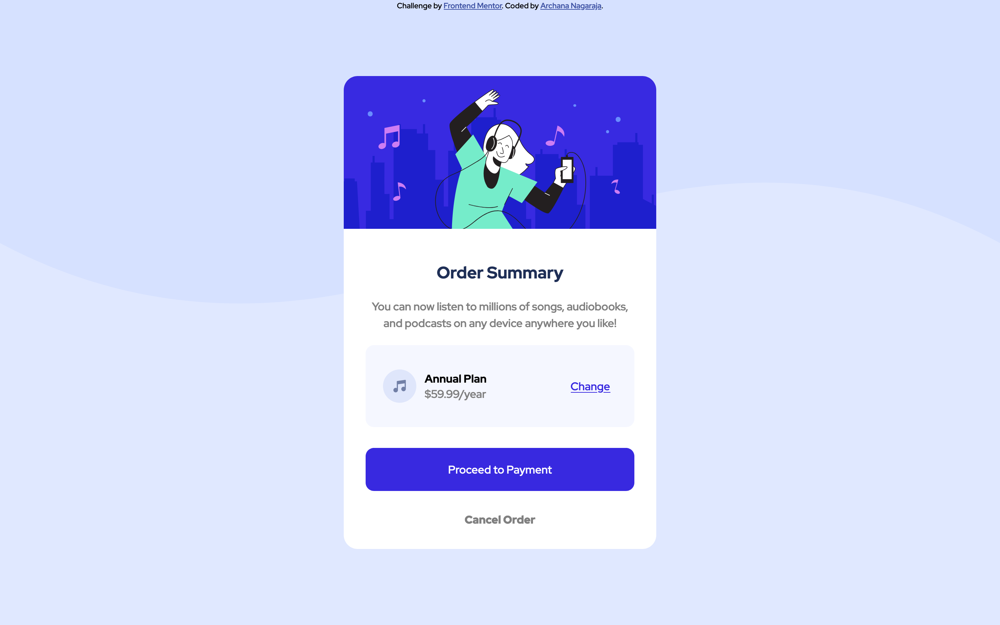
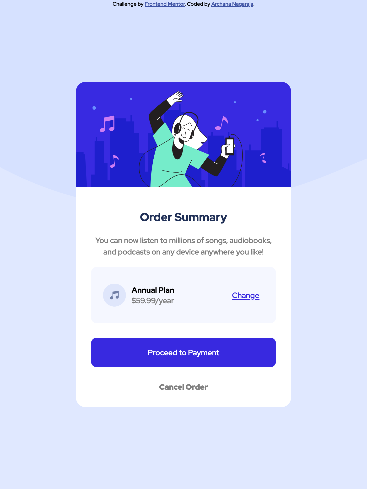

# Frontend Mentor - Order summary card solution

This is a solution to the [Order summary card challenge on Frontend Mentor](https://www.frontendmentor.io/challenges/order-summary-component-QlPmajDUj). Frontend Mentor challenges help you improve your coding skills by building realistic projects.

## Table of contents

- [Overview](#overview)
  - [The challenge](#the-challenge)
  - [Screenshot](#screenshot)
- [My process](#my-process)
  - [Built with](#built-with)
  - [What I learned](#what-i-learned)
- [Contact Author](#author)

## Overview

### The challenge

Build the order summary card component and get it looking as close to the design as possible.

You can use any tools you like to help you complete the challenge. So if you've got something you'd like to practice, feel free to give it a go. See hover states for interactive elements

### Final Outcome

Laptop

iPad

iPhone

### Links

- Solution URL: [Github](https://github.com/archana-nagaraj/FrontendMentorChallenge-OrderSummaryComponent)
- Live Site URL: - [GitHub Pages](https://archana-nagaraj.github.io/FrontendMentorChallenge-OrderSummaryComponent/)

## My process

### Built with

- Semantic HTML5 markup
- CSS
- Flex

### What I learned

- Learnt how to read understand any given challenge - the starter kit including design, images with style-guide
- How to start on a project
  - Start with the readme , styleguide and then the html markup with styling at the end.
- Learnt about different CSS properties
- Practiced media queries, responsive UI

## Contact Author

- Frontend Mentor - [@archana-nagaraj](https://www.frontendmentor.io/profile/archana-nagaraj)
- Github - [@archana-nagaraj](https://github.com/archana-nagaraj)
- Email - [archana.nagaraj](archana.nagaraj@gmail.com)
